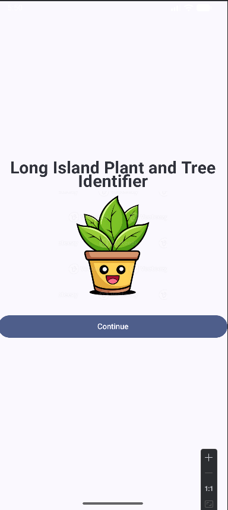

# CSC 371 Individual Project # 1

### Description: Android app with a splash screen, login page and register page with validation created using Jetpack Compose, android controls, intents and dialogs. 

## Features:
1. Splash screen with the app name and logo.
2. Users can either log in or register.
3. Register page has fields for first name, family name, DOB, email and password.
4. Validation for the inputted text. 
5. Works on phones and tablets. 

You should have for your app:

    You should then move to a screen that asks the user for either to log in or to register.

    If the user clicks the registration page, the registration page should have fields for at least first name, family name, date of birth, email, and password.

    Validate that the entered data is not empty.

    Check that the entered data is correct (such as email validation, first name should at least 3 char and not more than 30)

    If registration is successful return to the previous screen.

    Enable login (it doesn’t have to be linked to a database at this stage)

    You need to add comments to your code.

    You need to have a nice design.

    Make sure that you test your app at least on two different devices (phone and tablet) and for portrait and landscape modes. 

### App Icon

### App Splash screen

