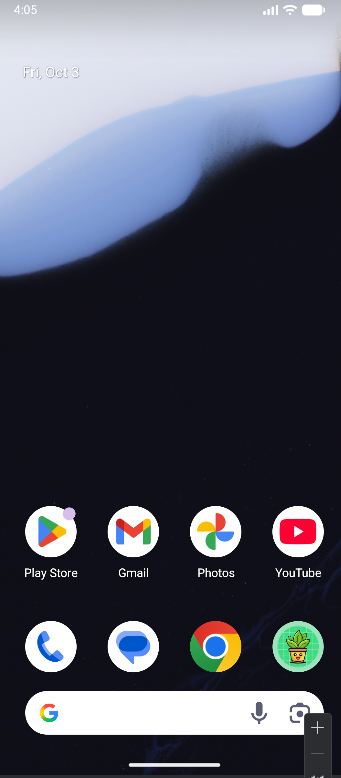

# CSC 371 Individual Project # 1

### Description: Android app with a splash screen, login page and register page with validation created using Jetpack Compose, android controls, intents and dialogs. 

## Features:
1. Splash screen with the app name and logo.
2. Users can either log in or register.
3. Register page has fields for first name, family name, DOB, email and password.
4. Validation for the inputted text.
5. All text boxes must be filled in.
6. All passwords must be greater than 6 characters and less than 30.
7. All emails must be valid emails.
8. First names and last names must be greater than 3 characters and less than 6.
9. Date of birth is validated using regex. 
10. Uses Toast widget notifications for validation.
11. If an account is created, the user will get a notification their account was created.
12. If the user enters a email and password, they will get a notification they they have a successful login. 
13. Works on phones and tablets. I had to add a scrollable state.
14. Styles: light gray background, rounded text fields,

### Phone Images

### Tablet Images

